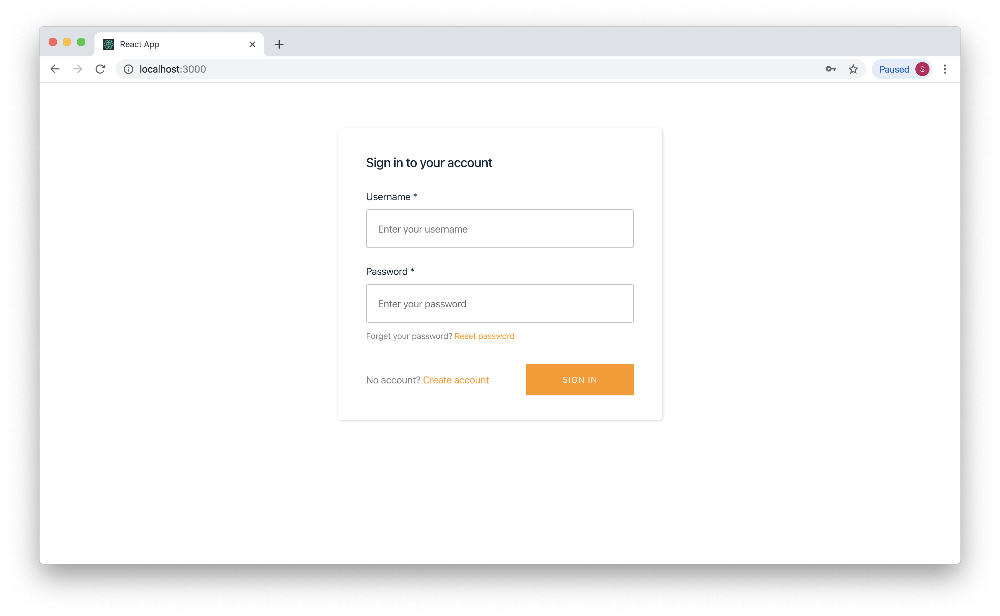
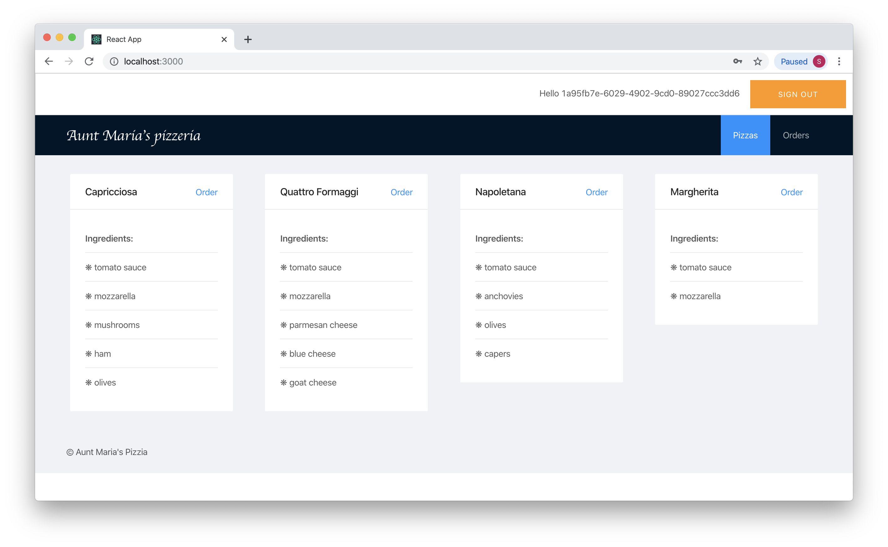

# Aunt Maria's pizzeria

This is a sample front end project for an API from the "Serverless Applications with Node.js book." This project was bootstrapped with [Create React App](https://github.com/facebook/create-react-app), and it uses [React Router](https://reacttraining.com/react-router/web/), [Ant Design](https://ant.design), and [AWS Amplify for React](https://aws-amplify.github.io).

Keep in mind that this project is not a production ready application, it is just a simple example that should show you how your Pizzeria API connects to the frontend application.

## How to use the project

In order to use this project, you'll need to run the React application and to change the project configuration.

### Prerequisites

Before you continue, make sure you have Node.js with npm, latest stable versions are recommended. You can get and install Node.js and npm from the official Node.js website: https://nodejs.org/en/.

### Run the app

To run the app, do the following:

1. Clone this repository.
2. From your terminal, navigate to the project folder and run the `npm install` command.
3. After the dependencies are installed, run the `npm run start` command to start the project. This command will build your project, run the watch scripts that will rebuild the project after any changes in the code, and open http://localhost:3000 in the browser.

This will show the following page in your browser:



You'll need to create an account to continue. By creating an account you'll add a new user to the Cognito User pool. Make sure you enter a real email address, because Cognito will send you a verification code to that email address.

The UI and login/signup functionaly is provided by AWS Amplify React library. If you want to lear how to customize or use your onw UI components, see the [customization section for AWS Amplify React components](https://aws-amplify.github.io/docs/js/authentication).

_Note_: By default, this frontend application points to a sample API on our AWS account. In case you are not comfortable signing up with our account, you can go to the next section and configure the app to point to your API before signing up.

After you log in, you should see the following page:



### Point the app to your API

To configure your API, you'll need to modify [`./src/config.js`](./src/config.js) file in your React app project.

By default, this file has the following content:

```javascript
const config = {
  aws_project_region: 'eu-central-1',
  aws_cognito_identity_pool_id: 'eu-central-1:1bc1c606-f159-43e9-b090-117b6983768d',
  aws_cognito_region: 'eu-central-1',
  aws_user_pools_id: 'eu-central-1_qynKm3Cn8',
  aws_user_pools_web_client_id: '68u98au0oq2qotp7neu7haagll',
  oauth: {},
  aws_appsync_authenticationType: 'AMAZON_COGNITO_USER_POOLS',
  apiUrl: 'https://itly1o3ab7.execute-api.eu-central-1.amazonaws.com/latest'
}

export default config
```

Most of the values (except the last one), are required by the AWS Amplify.

Here's an explanation of all properties:

- `aws_project_region` tells Amplify in which region is your project. You can change this value to the region you used to deploy your Pizzeria API.
- `aws_cognito_identity_pool_id` is your Cognito Identity pool ID. You can get this value from the AWS Web Console. To do so:
  - Go to [Cognito section](https://eu-central-1.console.aws.amazon.com/cognito).
  - Click on the "[Manage Identity Pools](https://eu-central-1.console.aws.amazon.com/cognito/federated/)" button.
  - Select your Identity pool.
  - Copy the ID from the URL or "Sample code" section
- `aws_cognito_region` tell Amplify in which region are your Cogito user and identity pools.
- `aws_user_pools_id` is your Cognito user pool ID. To get it from the AWS Web Console, do the following:
  - Go to [Cognito section](https://eu-central-1.console.aws.amazon.com/cognito).
  - Click on the "[Manage User Pools](https://eu-central-1.console.aws.amazon.com/cognito/users/)" button.
  - Select your Identity pool.
  - Copy *Pool Id* value.
- `aws_user_pools_web_client_id` is your client secret. It's part of your Cognito User pool. To get this value, do the following:
  - Go to [Cognito section](https://eu-central-1.console.aws.amazon.com/cognito).
  - Click on the "[Manage User Pools](https://eu-central-1.console.aws.amazon.com/cognito/users/)" button.
  - Select your Identity pool.
  - Click to the "App client settings" link in the side bar.
  - Copy _ID_ value from the App client settings page.
- `oauth` leave this value as is.
- `aws_appsync_authenticationType` this value tells Amplify which type of auth are you using, leave it as is.
- `apiUrl` this is the API URL of your Pizza API. You can get it from the output of the `claudia update` command.

Once you changed all the values, restart the frontend by running the `npm run start` command again, and your app will point to your backend and your Cognito User pool.

#### Potential issues

> Not able to finish signup because automatic email verification is not enabled

In case you are not able to finish your signup because automatic email verification is off, you'll need to do the following:

- Go to [Cognito section](https://eu-central-1.console.aws.amazon.com/cognito).
- Click on the "[Manage User Pools](https://eu-central-1.console.aws.amazon.com/cognito/users/)" button.
- Select your Identity pool.
- Click to the "MFA and verifications" link in the side bar.
- Select the "Email" checkbox in the "Which attributes do you want to verify?" section.
- Click on the Save changes button.
- Go to your browser and resend verification code.

Why is this happening?

By default AWS Amplify React components requires verification step, and you have two options: to enable verification or to customize signup process. If we created signup process from scratch instead of using Amplify components, we would not have the same issue.

## Additional questions?

If you have any additional questions, please open an issue in this repository.